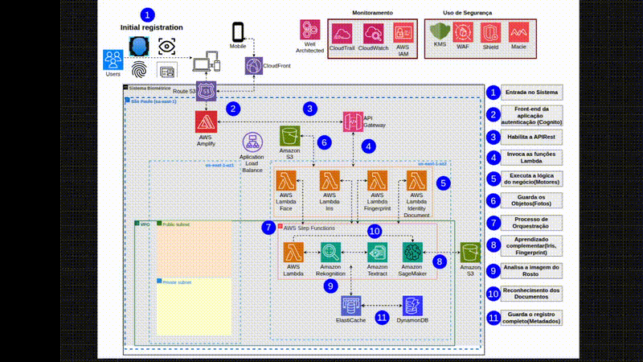

# Sistema Biométrico Nacional (AWS Cloud-Based)

Este projeto propõe o desenvolvimento de um Sistema Biométrico Nacional, uma aplicação moderna, centralizada e segura, construída inteiramente sobre os serviços gerenciados da AWS (Amazon Web Services).

### 🎯 Objetivos da Solução
✅ Unificar registros biométricos (face, íris, digitais e documentos).

✅ Reduzir fraudes e duplicidades com maior precisão na identificação.

✅ Apoiar investigações e o combate a crimes.

✅ Minimizar custos operacionais com a consolidação de sistemas.

✅ Atuar como identidade digital interoperável entre órgãos públicos.

✅ Simplificar a verificação de identidade para o cidadão.

### ⚙️ Requisitos Funcionais (RF)
📌 Registro biométrico (Face, Íris, Digitais, Documento de Identidade).

🔍 Consulta por similaridade.

🔐 Autenticação via login seguro com Amazon Cognito.

🤖 Processamento com Inteligência Artificial utilizando:

Amazon Rekognition (análise de imagem),

Amazon Textract (leitura de documentos),

Amazon SageMaker (treinamento de modelos).

### 🔒 Requisitos Não Funcionais (RNF)
🟢 Alta disponibilidade: Multi-AZ com uptime superior a 99%.

💥 Tolerância a falhas e recuperação de desastres: Orquestração segura e eficiente.

📈 Escalabilidade automática: Crescimento elástico dos recursos conforme a demanda.

⚖️ Conformidade (LGPD): Criptografia ponta a ponta, controle de acesso e privacidade.

🛡️ Segurança: Proteção de dados sensíveis com controle de acesso rigoroso e criptografia.

### 🧱 Arquitetura Técnica (AWS Cloud)

### A seguir, a descrição detalhada dos componentes da arquitetura:

1. Users, Amazon Route 53 & Amazon CloudFront
Função: Entrada do usuário via navegador/app, com roteamento DNS (Route 53) e entrega acelerada de conteúdo (CloudFront).

Conexões: Redirecionam para o front-end hospedado no AWS Amplify.

2. AWS Amplify
Função: Hospeda o front-end da aplicação (React, Angular etc.).

Conexões: Integra com Cognito (auth), API Gateway (REST), Route 53 e CloudFront.

3. Amazon Cognito
Função: Gerencia login seguro, autenticação e tokens de sessão.

Conexões: Front-end (Amplify), API Gateway, IAM.

4. Amazon API Gateway
Função: Expõe as APIs RESTful e direciona requisições aos back-ends.

Conexões: Amplify, Lambda, IAM.

5. Application Load Balancer (ALB)
Função: Balanceia a carga entre funções Lambda e possíveis microserviços.

Conexões: API Gateway, Lambda, containers futuros.

6. Amazon S3
Função: Armazena imagens, digitais, documentos e logs.

Conexões: Lambda, Rekognition, Textract, SageMaker, Step Functions.

7. AWS Lambda
Função: Processa lógica de negócio, aciona serviços de IA, grava no DynamoDB.

Conexões: API Gateway, S3, Step Functions, Rekognition, Textract, SageMaker, DynamoDB.

8. AWS Step Functions
Função: Orquestra o fluxo de análise biométrica com controle de estado.

Conexões: Lambda, Rekognition, Textract, SageMaker, S3, SQS/SNS, DynamoDB.

9. Amazon Rekognition
Função: Reconhecimento facial, íris e digitais com comparação e similaridade.

Conexões: Lambda, Step Functions, S3, DynamoDB.

10. Amazon Textract
Função: Extração de dados estruturados a partir de documentos.

Conexões: S3, Lambda, DynamoDB.

11. Amazon SageMaker
Função: Treinamento e ajuste de modelos para reconhecimento avançado.

Conexões: S3 (dados), Lambda (inferência), DynamoDB.

12. Amazon DynamoDB
Função: Armazena registros biométricos, metadados, logs e resultados de IA.

Conexões: Lambda, Rekognition, Textract, SageMaker, Macie, DAX, ElastiCache.

13. Amazon DAX (DynamoDB Accelerator)
Função: Acelera a leitura do DynamoDB com cache in-memory.

Conexões: Lambda, Rekognition, DynamoDB.

14. Amazon ElastiCache (Redis)
Função: Armazena sessões, tokens e dados temporários de autenticação.

Conexões: Lambda, DynamoDB.

### 📌 Observações Finais
Este projeto é escalável, seguro e orientado a conformidade com a LGPD.

A arquitetura é totalmente modular e utiliza o melhor dos serviços serverless e gerenciados da AWS.

Pode ser expandida para uso por múltiplos órgãos públicos de forma interoperável.

### 🛠️ Tecnologias Principais
Amazon Web Services (AWS)

Lambda, Rekognition, Textract, SageMaker, Cognito, API Gateway, S3, DynamoDB, Amplify, etc.

Segurança: Criptografia ponta a ponta, IAM, LGPD Compliance.

Infraestrutura: Serverless, Alta Disponibilidade, Multi-AZ.

### Link do projeto completo: https://drive.google.com/file/d/1M1QyzT1cQEaxkp7Fdb8uG55IU62UvELe/view?usp=drive_link
